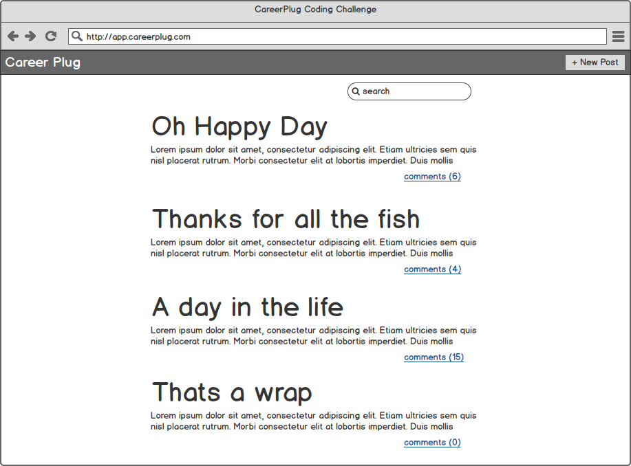
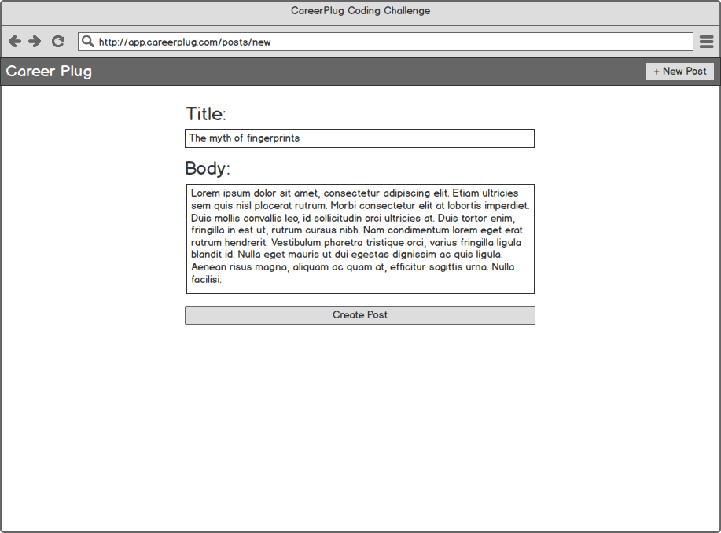
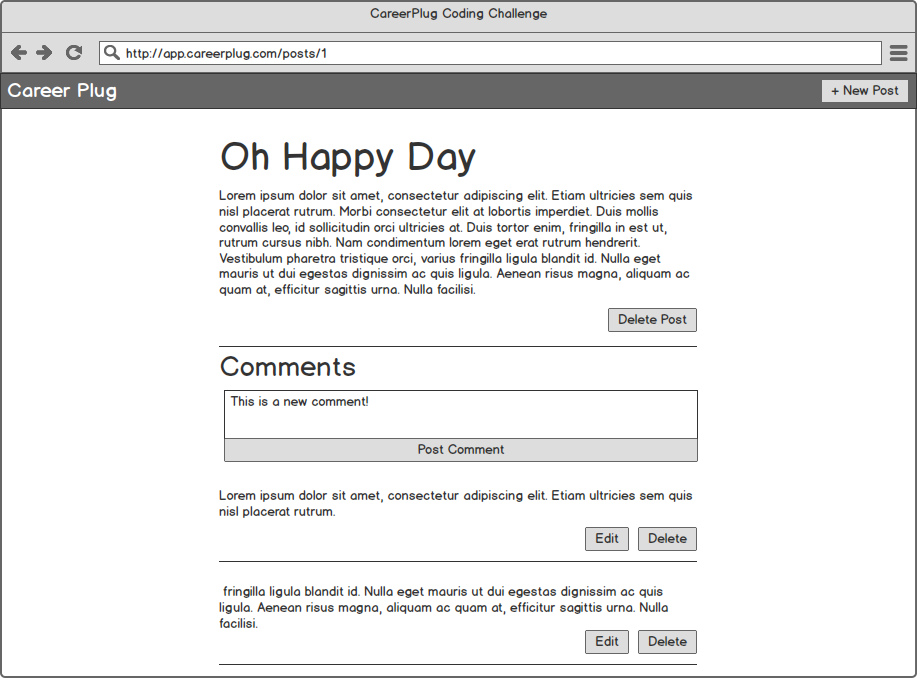

# Career Plug Coding Challenge

This is the Career Plug coding challenge. Bellow you will find a set of instructions on how to complete and submit the project. If you have any questions at all please submit an issue or contact us directly!

## Introduction
This challenge will be completed using the stater Ruby on Rails project found in this repository. To get started fork the repository to your Github account. Once you have completed the challenge, and are ready for it to be reviewed, please put in a pull request to the base repository.

## Instructions
You will be building a simple blog for this challenge. There has been some work done for you already, to help get you started, but most of the heavy lifting will be left up to you. The general idea of the blog is as follows.

There are `Post` and `Comment` models. Each post can have many different comments. A comment cannot exist without a `Post`. If a `Post` is deleted, all of its related `Comment` models should be deleted as well. You should be able to _create_ and _delete_ `Post`, as well as _create_, _edit_ and _delete_ comments. There should also be search functionality, that allows you to search for a specific `Post`, you can wire up the search to key off of the `title`, `body` or _both_.

Below are some more specific instructions about the expected flow of the application.

- When you visit the site you are directed to a page showing all `Post`.
  - Each post will consist of a `title` and `body`
  - On this page the `body` of each `Post` should be abbreviated, so all of the text is not showing
  - Each post should have a link indicating how many `Comments` the post has
    - This link, when clicked, should take you to a page showing the `Post`

  - This page should also contain the search bar to search through `Post`
    - After submitting a search you should be redirected back to the `index` page and see a subset of post that match the search criteria.

- When viewing a single `Post`
  - You should have the ability to _delete_ the `Post`
  - All of the `Post` `Comments` should be listed here
  - You should also be able to add new `Comments`
    - You should be able to _edit_ and _delete_ each existing comment
    - How you choose to implement _editing_ and _deletion_ of comments is up to you. If you want to send an `AJAX` request, and write some javascript to handle updates that is fine, you can also wire it up in a more standard `Rails` way and have it do a full page turn.

These are the basic requirements of the challenge. If you are able to get all of this functionality completed you will be in a pretty good spot. Of course, there is much more you can do with this challenge. If there is additional functionality that you would like to add, please feel free to do so. Though, we would prefer a sound limited app, over a fully featured app that was more rough around the edges.

Some examples of extensions you add may be:
  - Displaying a human readable created at date for a `Post`
  - Adding a `Tag` model that can be associated to a `Post` with the ability to search by `Tag`
  - Adding a `User` model with basic authentication and an association to `Post`
  - Any other functionality that you can think of!

Be sure to comment your code so we can see that you understand what is going on, especially if you use scaffolding to generate resources!

## Starter Code
This project comes with some starter code to help you along. We have provided the skeleton for the `PostsController`,  and the `Post` model. Corresponding views have been created in the `app/views/posts` directory. As well as routes, in the `config/routes.rb` file, and migrations in the `db/migrate` directory.

This is to provide you with some basic setup so you are not starting from absolutely nothing. There have also been some comments added to point you in the direction of helpful documentation.

## Using Javascript
This project has been created with the `--webpack=react` flag. What this means is that you have the ability to write React code in your views pretty easily. This is not a requirement, however if you would like to use this functionality you are more than welcome too. On a side note - rails also offers the ability to create a new project with a standard webpack config for Angular and Vue.js as well. If you are interested in using one of these frameworks feel free to do so. [Here](https://medium.com/@hpux/rails-5-1-loves-javascript-a1d84d5318b) is a good article with some helpful advice on how to take advantage of this approach.

You will also need [Node.js](https://nodejs.org) to take advantage of the Javascript features. If you do not have Node installed already you can download the installer for your operating system [here](https://nodejs.org/en/download/)

## Rails setup
If you've never installed Ruby / Rails on your machine before that is ok. If you are developing on a Mac, the wonderful people at [thoughtbot](https://thoughtbot.com/) have graciously created a script that does most of the work for you which you can find [here](https://github.com/thoughtbot/laptop)

If you are developing on Linux or Windows, you may have a more difficult journey ahead of you, though the following resources should help you on your way:
Windows - [Pragmatic Studio](https://pragmaticstudio.com/blog/2010/09/23/install-rails-ruby-windows) / [treehouse](http://blog.teamtreehouse.com/installing-rails-5-windows)
Linux - [treehouse](http://blog.teamtreehouse.com/installing-rails-5-linux)

Set up time should not be included towards your total time to complete the challenge. If you have any issues whatsoever please do not hesitate to contact us and we can assist / find alternatives to help you complete the challenge. Environment setup can be difficult and this is not the skill set we are looking to evaluate.

## Mockups
We've included some mockups below to help you visualize this site. Though, please do not feel that you have to model the layout of your site after these mockups. You are free to style your site however you want! These are provided as another resource for you, and are by no means strict guidelines.

**Viewing All Post**

**Creating a new Post**

**Viewing a single Post**

